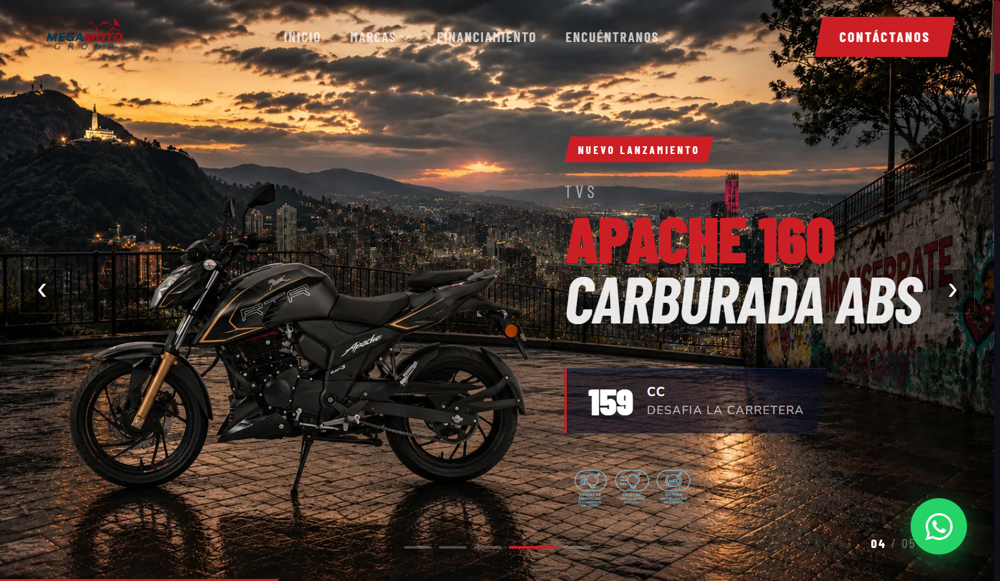

# ¡Hola! Soy Sebastián Sotomayor (@SebasYe05)

  

## 📋 Sobre mí

Técnico en Programación de Software y apasionado SENA Lover ^^, actualmente me formo como Tecnólogo en Análisis y Desarrollo de Software (ADSO).

  

### 🎯 Metodología

A través de mi formación, he comprendido que crear un gran producto conlleva mucho más que escribir líneas de código; implica dominar todo el ciclo de vida del software. Por eso, me enfoco con rigurosidad en:

* 📐 **Diseño de diagramas** y arquitectura
* 📋 **Planeación de estrategias** de calidad
* ✅ **Elaboración de planes de pruebas** comprensivos
* 🔍 **Control de calidad** riguroso

---

## 🔎 ¿Buscando un nuevo talento?

Actualmente me encuentro respaldado y patrocinado por **ASNET**, una oportunidad por la cual me siento profundamente agradecido, ya que me permite enfocarme de lleno en mi crecimiento y desarrollo profesional.

Mi formación en el programa **ADSO** me ha brindado una visión integral del software. En este proceso he aprendido que el desarrollo no se limita únicamente a escribir código; abarca todo el ciclo de vida del software, incluyendo el modelado con diagramas, el control de calidad, la documentación y la ejecución de pruebas. Esto me permite priorizar siempre soluciones limpias, funcionales y verdaderamente escalables. **Gracias SENA!!**

Si te interesa conocer más sobre mi trabajo o crees que podemos colaborar en alguna iniciativa, [**¡me encantaría que habláramos!**](#-hablemos) 💬

---

## 🚀 Proyectos Destacados (ADSO & Personal)

### 📸 [PhotoBogotá - Fullstack](https://github.com/Photobogotanos/Frontend-Photobogota)
Plataforma para la gestión y visualización de fotografía urbana en Bogotá.
* **Backend:** Java Spring Boot, MongoDB, JWT, Maven, Arquitectura de capas. [Repo Backend](https://github.com/SebasYe05/backend-photobogota)
* **Frontend:** React, Leaflet (Mapas), Recharts, Axios, Framer Motion. [Repo Frontend](https://github.com/Photobogotanos/Frontend-Photobogota)
* **Infraestructura:** Docker.

### 🎮 [Mi Portafolio Web](https://github.com/SebasYe05/mi-portafolio)
Mi carta de presentación interactiva con un diseño único.
* **Tecnologías:** React, Tailwind CSS, Framer Motion.

### 🏍️ [Mega Moto - Sitio Web Corporativo](https://www.mega-moto.com/)
Desarrollo del sitio web oficial para empresa del sector motocicletas.

  

* **Repo:** Privado (cliente)
* **Sitio en producción:** [mega-moto.com](https://www.mega-moto.com/)
* **Tecnologías:** React, Vite, Leaflet, Framer Motion, React Helmet, Bootstrap, React Router DOM, React Icons.

---

## 💻 Stack Tecnológico

### 📱 Entorno de Desarrollo

  

Mi entorno de trabajo está optimizado en Linux, utilizando herramientas modernas para asegurar una máxima productividad y calidad en el código.

### 🛠️ Lenguajes y Backend

### 🌐 Frontend y Diseño

### 🎨 UI Components & Utilities

### 🗄️ Bases de Datos

### 🗺️ Mapas y Visualización

### ⚙️ DevOps, Infraestructura y Calidad

### 🔧 Móvil y Otros

---

## ¿Cómo contactarme?
## 📩 Hablemos:

---

*Gracias por visitar mi perfil. ¡Estoy abierto a nuevas oportunidades y colaboraciones!*
